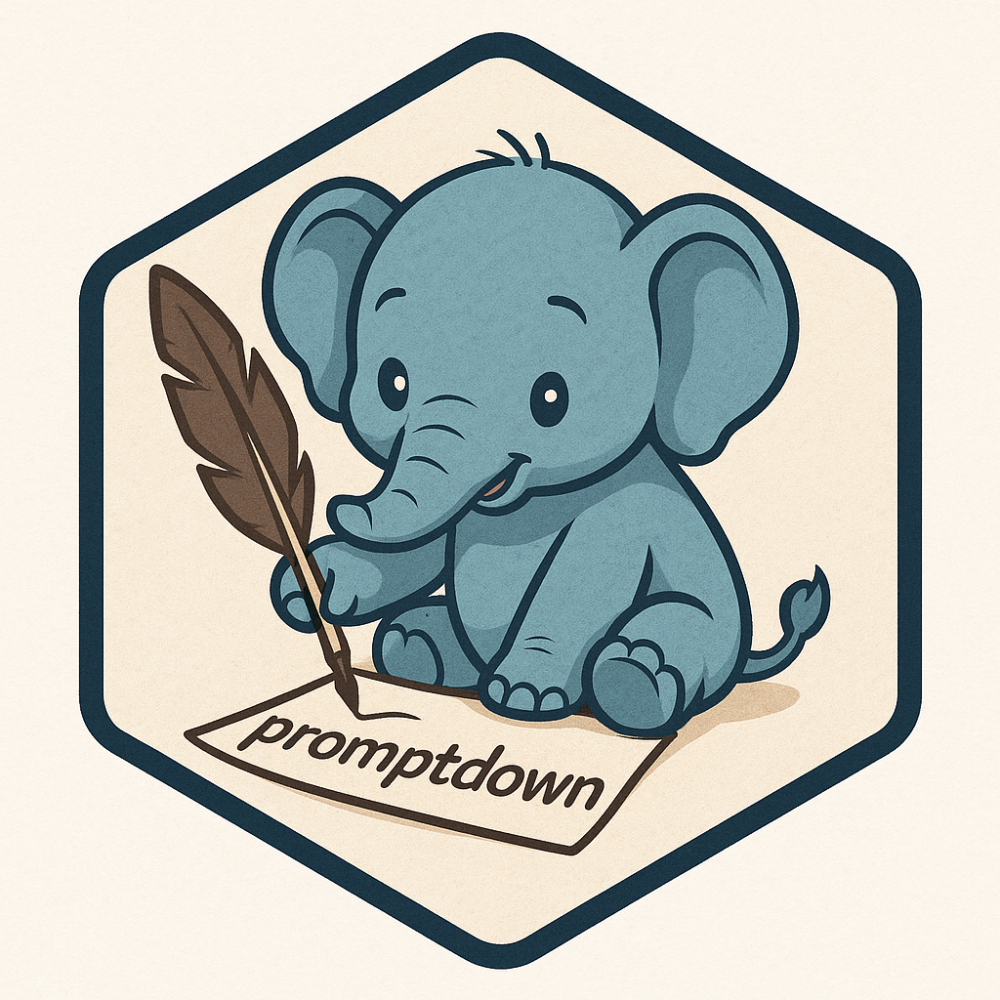

# promptdown 

The goal of **promptdown** is to make it easy to compose prompts for
LLMs. It's a literate programming interface for LLMs. Think
[knitr](https://yihui.org/knitr/) +
[ellmer](https://ellmer.tidyverse.org).

Coaxing desirable output from an LLM means iterating on the prompt--all
of it. That includes: prior chat turns, the system prompt, tool
definitions, tool calls and results, added files, thinking segments,
even stray formatting.

**promptdown** invites you to work directly with the prompt; to see and
shape all of it, every turn.

Key features:

-   Write prompts using markdown and code chunks.
-   Inspect and control the full context sent to the model.
-   Chat interactively or compose deployable agents.

<br>

## Example chat session

<video src="https://github.com/user-attachments/assets/dd380d1b-8464-42e8-9ca8-9bd745f67697" width="640" autoplay loop muted></video>

## Install

``` r
pak::pak("t-kalinowski/promptdown")
```

## How it works

You write in a prompt markdown document. This is a plain text file that
looks like a normal [Quarto](https://quarto.org) or Rmarkdown document.

The promptdown document defines the full request that's submitted to the
LLM for completion. Each chat turn, the document is submitted to the
LLM, and the LLM response is written back to the same document. In this
way it's similar to a conventional chat interface, except it's all plain
text, and you can easily observe and edit any part of it at any time.
There is no hidden prompt added.

All the interactive features and tooling of dynamic documents are
available. Use dynamic code chunks in R, Python, or [any other
language](https://bookdown.org/yihui/rmarkdown/language-engines.html) to
compose your prompt. See in-line previews of code chunks evaluations
(including plots and images). Use fine-grained control over output with
chunk options like `echo: false` and `results: asis`. Enjoy live access
to your current R or Python session REPL. Work in the full-featured text
editor you are already comfortable with.

You can also equip the LLM with tools (functions) it can call. In a code
chunk, simply define a function with a `declare(tool(...))` annotation,
or register tools directly using the standard
`ellmer::Chat$register_tool()` interface. Tool calls and results are
presented as plain text that can be edited or removed for the next turn.
You can even turn tool calls into dynamic code chunks to iterate on.

To submit a prompt, call `run_chat_sheet()` (recommended to bind to
keyboard shortcut Ctrl/Cmd + Shift + R). This will:

1.  Evaluate dynamic code chunks, typically to:

    -   Create the `ellmer::Chat` object which picks the provider and
        model config.
    -   Emit text output to include in the prompt.
    -   Register tools.

2.  Render the document into a static sequence of chat turns.

3.  Submit the turns and tools for a completion request to the LLM.

4.  Stream the LLM response back into the document under a new `# LLM`
    heading

You can freely edit any part of the prompt in between completion
requests (it’s all plain text). You can even edit while the output from
the previous request is still streaming.

When you're ready for the next turn, rerun `run_chat_sheet()`: if
there’s a new `# User` turn at the end, the next LLM response is
appended; otherwise, the previous LLM response is replaced.

------------------------------------------------------------------------

## Disposable *and* Deployable

Some of the most helpful interactions with LLMs are quick and
disposable: rubber-ducking sessions exploring ideas, with the output
quickly discarded. These are similar to a web search or an EDA session
at the REPL.

Promptdown makes those easier by giving you powerful tools for quickly
composing and refining prompts in a full-featured text environment.

But LLMs can also power more persistent, agent-like workflows. Data
professionals can bundle a prompt with tools and deploy it, just like a
dashboard or automated report.

Promptdown supports that too. A promptdown document is also a deployable
artifact. Simply call `read_chat_sheet()` to get back an assembled
`ellmer::Chat` object ready to submit completion requests.

## Additional conveniences

### Images

Images included with markdown syntax are automatically handled by
`ellmer::content_image_file()`

``` markdown

```

### `ellmer::Content`

Promptdown defines a custom render method for `ellmer::Content` objects
returned by code chunks. This lets you include not just images, but
other content types supported by ellmer (and the model). For example, to
include a PDF in the completion request:

```` markdown
```{r}
ellmer::content_pdf_file("/path/to/file.pdf")
```
````

### `help()`

promptdown also includes a custom render method for help objects,
showing documentation as plain text in the markdown output. For example,
to include help for `dplyr::filter`:

```` markdown
```{r}
?dplyr::filter
```
````

### Engines

In addition to the standard knitr engines (`r`, `python`, `julia`,
`verbatim`, `embed`, etc.), promptdown adds two more you can use:

#### `tool` engine

This simulates the LLM calling a tool. You can use it to quickly test
tool definitions or generate the prompt dynamically.

Example:

```` markdown
```{r}
library(promptdown)
knitr::opts_chunk$set(comment = '', echo = FALSE)
chat <- ellmer::chat_ollama(model = "qwen3:4b")
```

## System

You are a helpful New York trip planning assistant.

```{r}
get_current_weather <- function(location = "") {
  declare(tool(
    "Get the current weather",
    location = type_string()
  ))

  list(temp = 65, conditions = "sunny")
}
```

## User

Should I bring an umbrella?

## LLM

```{tool}
get_current_weather(location = "New York")
```
```
{"temp":65,"conditions":"sunny"}
```
````

#### `btw`

The [btw](https://posit-dev.github.io/btw/) package includes many
helpers for assembling context quickly. Use the `{btw}` engine to
preview content with standard `btw::btw()` syntax:

```` markdown
```{btw}
mtcars
```

## Context

mtcars
```json
{"n_cols":11,"n_rows":32,"groups":[],"class":"data.frame","columns":{...}}
```
````
